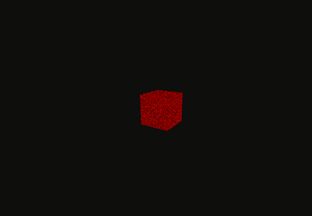
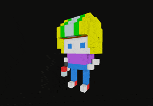
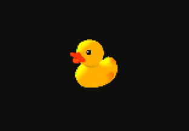

# react-postprocessing

[postprocessing](https://vanruesc.github.io/postprocessing) wrapper for React and [react-three-fiber](https://github.com/react-spring/react-three-fiber) for simplied effects setup. Instead of manually initializing the composer and adding required passes you can simply put all the effects inside of `<EffectComposer />`.

## Installation

```sh
yarn add postprocessing react-postprocessing
```

## Demos

<p align="middle">
  <a href="https://codesandbox.io/s/react-postprocessing-glitchnoise-demo-wd4wx"></a>
  <a href="https://codesandbox.io/s/react-postprocessing-ssao-smaa-and-bloom-demo-r9ujf">
  
  </a>
  <a href="https://codesandbox.io/s/react-postprocessing-pixelation-demo-tcct8">
  
  </a>
</p>

<p align="middle">
  <i>Click on a demo to inspect code and full view.</i>
</p>

## Getting Started

### Effect composer

#### Passing effects

##### with children

All effects are consumed by effect composer, `EffectComposer`, that creates passes and other things required for compositor to work.

You can pass effects using children:

```jsx
import React from 'react'
import { EffectComposer, Glitch } from 'react-postprocessing'
import { Canvas } from 'react-three-fiber'

const App = () => (
  <Canvas>
    <mesh>
      <boxGeometry args={[1, 1, 1]} />
      <meshBasicMaterial color="red" />
    </mesh>
    <EffectComposer>
      <Glitch />
    </EffectComposer>
  </Canvas>
)
```

##### using `effects` prop

It is also possible to pass effects as an array. Note that you have to import effects from `postprocessing` in this case, not from `react-postprocessing`.

```jsx
import React, { useMemo } from 'react'
import { EffectComposer, Glitch } from 'react-postprocessing'
import { Canvas } from 'react-three-fiber'
import { NoiseEffect } from 'postprocessing'

const App = () => {
  const Noise = useMemo(() => new NoiseEffect(/* props */))

  return (
    <Canvas>
      <mesh>
        <boxGeometry args={[1, 1, 1]} />
        <meshBasicMaterial color="red" />
      </mesh>
      <EffectComposer effects={[Noise]} />
    </Canvas>
  )
}
```

#### SMAA

By default, `SMAA` is disabled in `EffectComposer`. When enabled, you can pass additional properties for configuring SMAA, such as `edgeDetection`, which sets edge detection threshold. Note that SMAA uses a loader so you have to wrap everything in `Suspense`:

```jsx
<Suspense fallback={null}>
  <EffectComposer smaa edgeDetection={0.3}>
    <Glitch />
  </EffectComposer>
</Suspense>
```

### Adding effects

When you want to add a new effect your `react-three-fiber` component you first need to import the effect and then put it in children.

```jsx
import React from 'react'
import { EffectComposer, Glitch } from 'react-postprocessing'
import { Canvas } from 'react-three-fiber'

const App = () => (
  <Canvas>
    <mesh>
      <boxGeometry args={[1, 1, 1]} />
      <meshBasicMaterial color="red" />
    </mesh>
    <EffectComposer>
      <Glitch />
    </EffectComposer>
  </Canvas>
)
```

### Effects settings

Every effects inherits all the props from original `postprocessing` class, for example:

```jsx
import React from 'react'
import { EffectComposer, Glitch } from 'react-postprocessing'
import { Canvas } from 'react-three-fiber'

const App = () => (
  <Canvas>
    <mesh>
      <boxGeometry args={[1, 1, 1]} />
      <meshBasicMaterial color="red" />
    </mesh>
    <EffectComposer>
      <Glitch delay={new Vector(2, 2)} />
    </EffectComposer>
  </Canvas>
)
```

### Custom effects

Currently not all of the effects are wrapped, so if you require some effects that isn't wrapped yet you cand add them manually.

#### Using `wrapEffect`

There is an utility function in `react-postprocessing` which wraps the `postprocessing` effect in React component. You can use it to quickly make a component out of effect:

```jsx
import React from 'react'
import { EffectComposer, wrapEffect } from 'react-postprocessing'
import { NoiseEffect } from 'postprocessing'
import { Canvas } from 'react-three-fiber'

const Noise = wrapEffect(NoiseEffect)

const App = () => (
  <Canvas>
    <mesh>
      <boxGeometry args={[1, 1, 1]} />
      <meshBasicMaterial color="red" />
    </mesh>
    <EffectComposer>
      <Noise />
    </EffectComposer>
  </Canvas>
)
```

> Currently types aren't being passed properly in `wrapEffect`, it returns `RefWithExoticComponent<any>` where instead of any should be the effect class. Feel free to submit a PR to fix it!

#### Using `effects` prop of `EffectComposer`

Another way is importing an effect and passing it to `effects`:

```jsx
import React, { useMemo } from 'react'
import { EffectComposer, Glitch } from 'react-postprocessing'
import { Canvas } from 'react-three-fiber'
import { NoiseEffect } from 'postprocessing'

const App = () => {
  const Noise = useMemo(() => new NoiseEffect(/* props */))

  return (
    <Canvas>
      <mesh>
        <boxGeometry args={[1, 1, 1]} />
        <meshBasicMaterial color="red" />
      </mesh>
      <EffectComposer effects={[Noise]} />
    </Canvas>
  )
}
```
