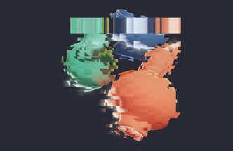

# react-postprocessing

 

<p align="middle">
	<a href="https://codesandbox.io/s/react-postprocessing-showcase-demo-dr9rj">
		
	</a>
</p>

[postprocessing](https://vanruesc.github.io/postprocessing) wrapper for React.

## Why

Instead of manually initializing the composer and adding required passes you can import the effects as components and put them inside `<EffectComposer />` for the easiest effect setup and better performance.

## Installation

```sh
yarn add postprocessing react-postprocessing
```

## Effects

For a list of effects, examples and props usage, check [effects.md](https://github.com/react-spring/react-postprocessing/blob/master/effects.md).

## Getting Started

### Effect composer

#### Passing effects

All effects are consumed by effect composer, `EffectComposer`, that creates passes and other things required for compositor to work.

You can pass effects using children:

```jsx
import React, { useState } from 'react'
import { EffectComposer, Glitch } from 'react-postprocessing'
import { Canvas } from 'react-three-fiber'

const App = () => {
  const [isTriggered, setTriggered] = useState(false)

  return (
    <Canvas>
      <mesh onClick={() => setTriggered(!isTriggered)}>
        <boxGeometry args={[1, 1, 1]} />
        <meshBasicMaterial color="red" />
      </mesh>
      <Suspense fallback={null}>
        <EffectComposer>
          <Glitch active={isTriggered} />
        </EffectComposer>
      </Suspense>
    </Canvas>
  )
}
```

#### SMAA

By default, `SMAA` is enabled in `EffectComposer`. When enabled, you can pass additional properties for configuring SMAA, such as `edgeDetection`, which sets edge detection threshold.

```jsx
<Suspense fallback={null}>
  <EffectComposer smaa edgeDetection={0.3}>
    <Glitch />
  </EffectComposer>
</Suspense>
```

### Adding effects

When you want to add a new effect your `react-three-fiber` component you first need to import the effect and then put it in children.

```jsx
import React from 'react'
import { EffectComposer, Scanline } from 'react-postprocessing'
import { Canvas } from 'react-three-fiber'

const App = () => (
  <Canvas>
    <mesh>
      <boxGeometry args={[1, 1, 1]} />
      <meshBasicMaterial color="red" />
    </mesh>
    <Suspense>
      <EffectComposer>
        <Scanline />
      </EffectComposer>
    </Suspense>
  </Canvas>
)
```

### Effects settings

Every effect inherits all the props from original `postprocessing` class, for example:

```jsx
import React from 'react'
import { EffectComposer, Glitch } from 'react-postprocessing'
import { Canvas } from 'react-three-fiber'

const App = () => (
  <Canvas>
    <mesh>
      <boxGeometry args={[1, 1, 1]} />
      <meshBasicMaterial color="red" />
    </mesh>
    <Suspense>
      <EffectComposer>
        {/* min and max duration */}
        <Glitch duration={[1, 2]} />
      </EffectComposer>
    </Suspense>
  </Canvas>
)
```

### Custom effects

Currently not all of the effects are wrapped, so if you require some effects that isn't wrapped yet you cand add them manually.

#### Using `wrapEffect`

There is an utility function in `react-postprocessing` which wraps the `postprocessing` effect in React component. You can use it to quickly make a component out of effect:

```jsx
import React from 'react'
import { EffectComposer, wrapEffect } from 'react-postprocessing'
import { NoiseEffect } from 'postprocessing'
import { Canvas } from 'react-three-fiber'

const Noise = wrapEffect(NoiseEffect)

const App = () => (
  <Canvas>
    <mesh>
      <boxGeometry args={[1, 1, 1]} />
      <meshBasicMaterial color="red" />
    </mesh>
    <Suspense>
      <EffectComposer>
        <Noise />
      </EffectComposer>
    </Suspense>
  </Canvas>
)
```

> Currently types aren't being passed properly in `wrapEffect`, it returns `RefWithExoticComponent<any>` where instead of any should be the effect class. Feel free to submit a PR to fix it!

#### From scratch

If the effect doesn't use object literals for props, `PixelationEffect` for instance, you can wrap your own component using `forwardRef` and `useImperativeHandle` and define your own props:

```jsx
import { forwardRef, useImperativeHandle, useMemo } from 'react'
import { PixelationEffect } from 'postprocessing'

export const Pixelation = forwardRef(({ granularity = 5 }, ref) => {
  const effect = useMemo(() => new PixelationEffect(granularity), [granularity])

  useImperativeHandle(ref, () => effect, [effect])

  return null
})
```

In case you want to do add a custom prop that isn't inherited from `postprocessing` you should watch this prop with `useLayoutEffect`:

```jsx
import { forwardRef, useMemo, useImperativeHandle, useLayoutEffect } from 'react'
import { useThree, ReactThreeFiber } from 'react-three-fiber'
import { DepthOfFieldEffect } from 'postprocessing'
import { Texture } from 'three'

export const DepthOfField = forwardRef(({ target, depthTexture, ...props }, ref) => {
  const { camera } = useThree()

  const effect = useMemo(() => new DepthOfFieldEffect(camera, props), [props])

  // custom `depthTexture` prop
  useLayoutEffect(() => {
    if (depthTexture) {
      effect.setDepthTexture(depthTexture.texture, depthTexture.packing)
    }
  }, [depthTexture])

  useImperativeHandle(ref, () => effect, [effect])
  return null
})
```
